# Telco Project – i2i Systems

> **Developer:** Meriç Baş  
> **Organisation:** i2i Systems  
> **Database:** Oracle XE 21c (Docker)  
> **Dataset:** 10 000 subscribers · 9 950 monthly records · 4 tariff plans

---

## Repository Structure

```
telco-project/
├── data/
│   ├── CUSTOMERS.csv              # 10 000 subscriber records
│   ├── MONTHLY_STATS.csv          # Monthly usage data (9 950 records)
│   └── TARIFFS.csv                # 4 tariff plans
├── screenshots/                   # Setup and query result screenshots
├── TABLE_CREATION_SCRIPTS.sql     # DDL: CREATE TABLE + indexes + constraints
├── SOLUTIONS.sql                  # Q1–Q6 SQL queries with explanations
├── QUERY_RESULTS.md               # Actual output of every query
├── telco_import.py                # Python import script for MONTHLY_STATS.csv
├── docker-compose.yml             # Oracle XE container configuration
├── SETUP.md                       # Step-by-step reproduction guide
└── README.md                      # This file
```

---

## Quick Start

```bash
# 1. Start the container (tables are created automatically on first run)
docker compose up -d

# 2. Wait ~3-5 minutes until "DATABASE IS READY TO USE!" appears
docker compose logs -f

# 3. Import TARIFFS and CUSTOMERS via DBeaver (see SETUP.md Step 4)

# 4. Import MONTHLY_STATS via Python script
pip install oracledb
python telco_import.py

# 5. Run the queries
# Open SOLUTIONS.sql in DBeaver → Ctrl+Enter on each query block
```

---

## Operational Requirements

### 1. Oracle XE Setup (Docker)

Running `docker compose up -d` starts an Oracle XE 21c container.  
`TABLE_CREATION_SCRIPTS.sql` is executed automatically on first startup (automated seeding).

**Starting the container:**

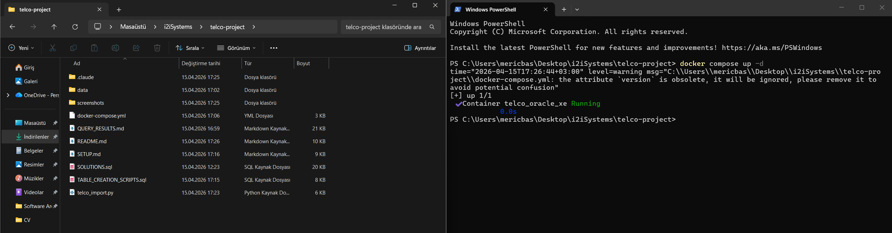

**Container in healthy state (`docker ps`):**

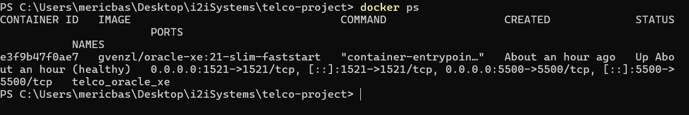

**Database ready log (`docker compose logs -f`):**

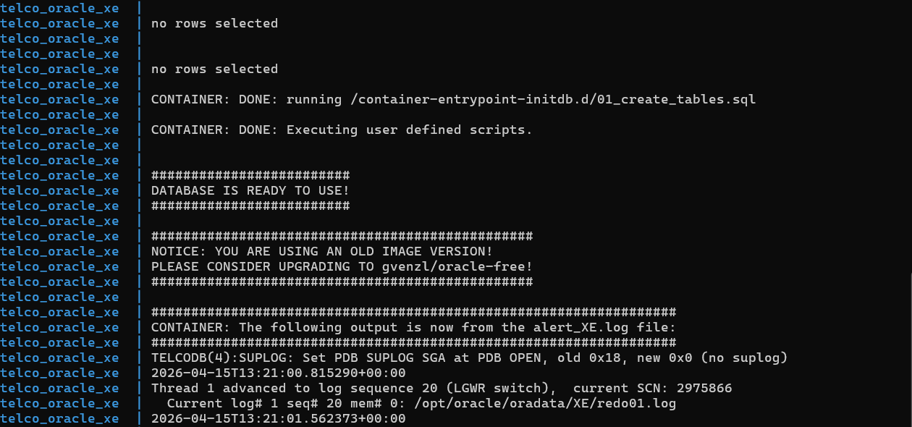

---

### 2. DBeaver Connection

| Field | Value |
|-------|-------|
| Connection Type | Service Name |
| Host | `localhost` |
| Port | `1521` |
| Service Name | `TELCODB` |
| Username | `TELCO_USER` |
| Password | `Telco2026!` |

**Connection settings:**

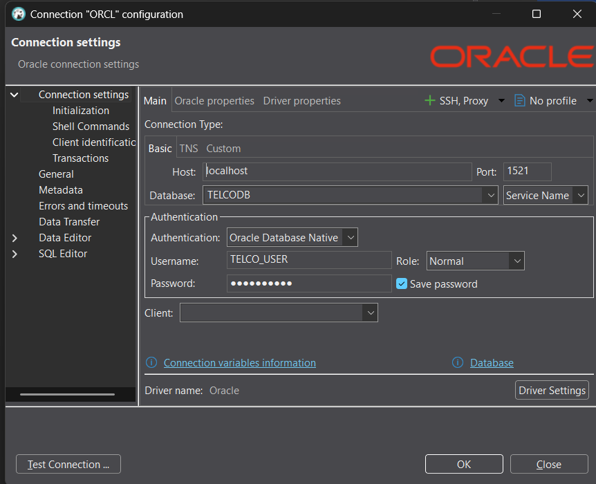

**Connection test successful:**

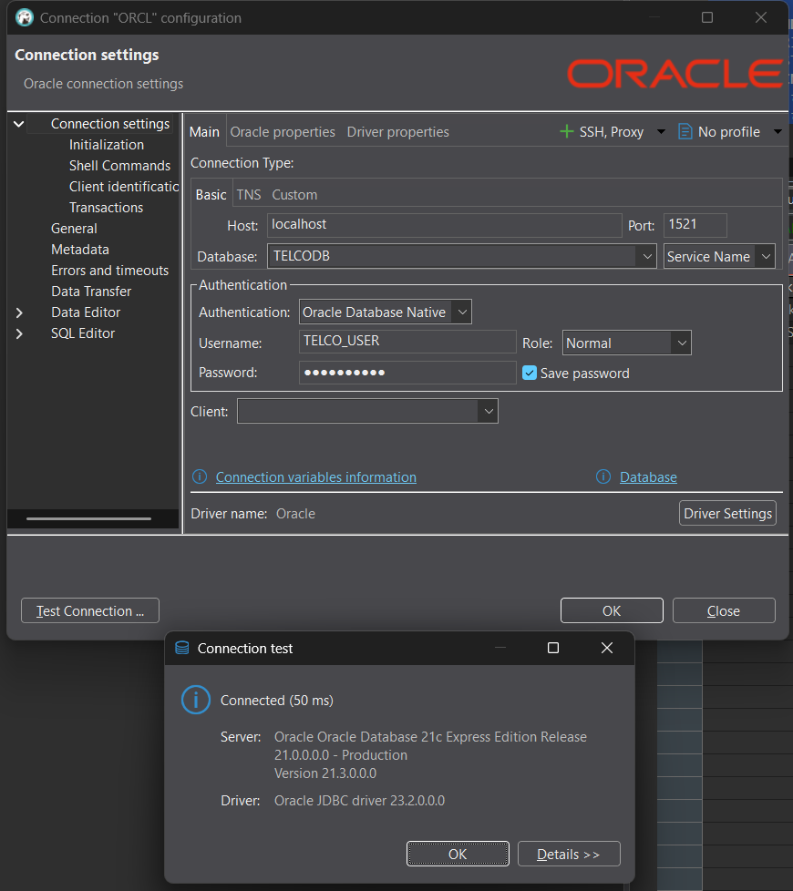

---

### 3. Data Import

#### TARIFFS & CUSTOMERS — via DBeaver

Right-click the table in Database Navigator → **Import Data → CSV**  
Settings: `Delimiter=,` | `Header=✅` | `Encoding=UTF-8`  
For CUSTOMERS, set date format to `dd/MM/yyyy` for the `SIGNUP_DATE` column.

**Tables visible in DBeaver Navigator:**

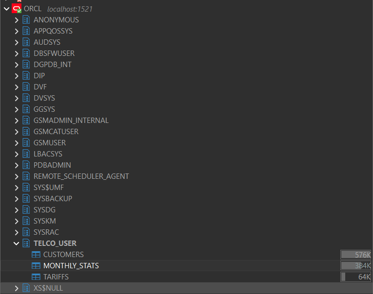

#### MONTHLY_STATS — via Python Script

`data/MONTHLY_STATS.csv` uses a European decimal comma in `DATA_USAGE`  
(e.g. `18420,61` = 18 420.61 MB), which causes DBeaver's standard import to fail.  
The Python script handles this automatically.

```bash
pip install oracledb
python telco_import.py
```

**Script output:**

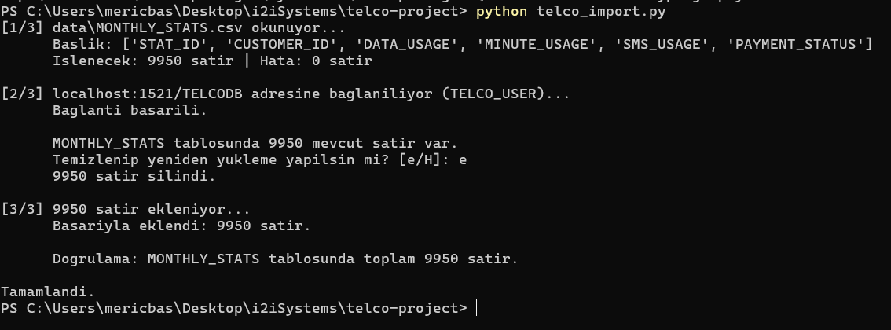

---

### 4. Bonus – Docker Compose & Automated Seeding

`TABLE_CREATION_SCRIPTS.sql` is mounted into the container's `initdb.d` directory,  
so tables are created automatically on first startup without any manual steps.

```yaml
volumes:
  - ./TABLE_CREATION_SCRIPTS.sql:/container-entrypoint-initdb.d/01_create_tables.sql:ro
```

Full reproduction guide: [SETUP.md](SETUP.md)

---

## Functional Requirements — Query Summary

All queries are in [SOLUTIONS.sql](SOLUTIONS.sql). Full output is documented in [QUERY_RESULTS.md](QUERY_RESULTS.md).

---

### Q1 – Tariff-Based Customer Queries

#### Q1.1 – Customers subscribed to 'Kobiye Destek'

**Result:** 2 483 customers

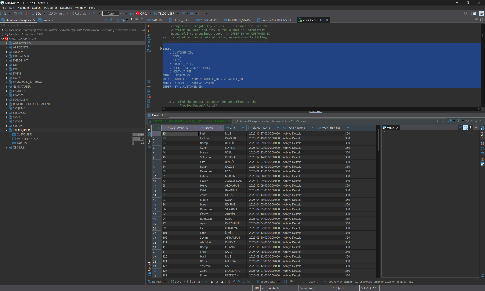

#### Q1.2 – Newest customer subscribed to this tariff

**Result:** 7 customers share the most recent signup date of **05/04/2026**

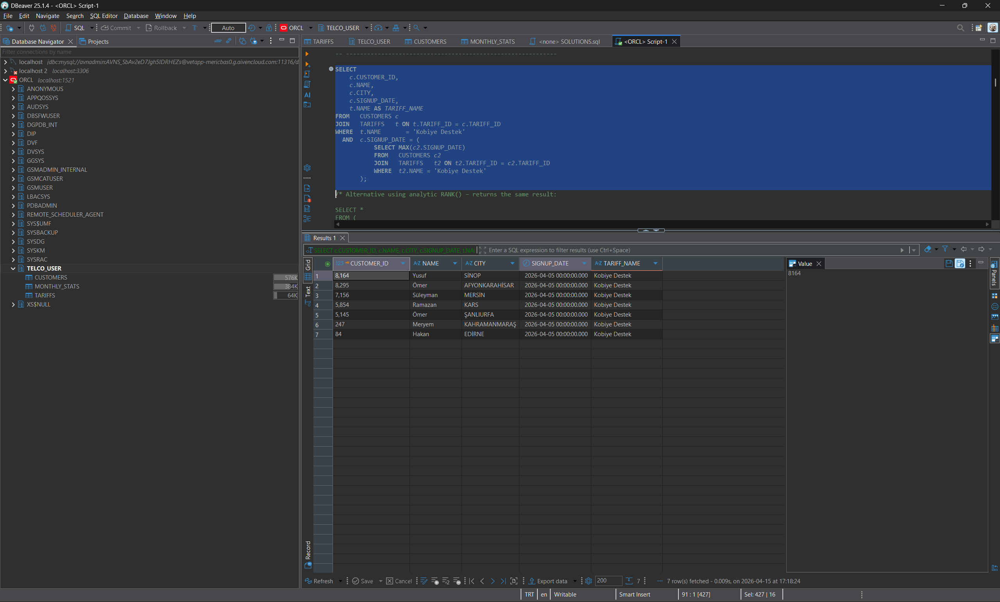

---

### Q2 – Tariff Distribution

#### Q2.1 – Distribution of tariffs among customers

| Tariff | Subscribers | Share |
|--------|-------------|-------|
| Kurumsal SMS | 2 577 | 25.77% |
| Genc Dinamik | 2 527 | 25.27% |
| Kobiye Destek | 2 483 | 24.83% |
| Calisan GB | 2 413 | 24.13% |

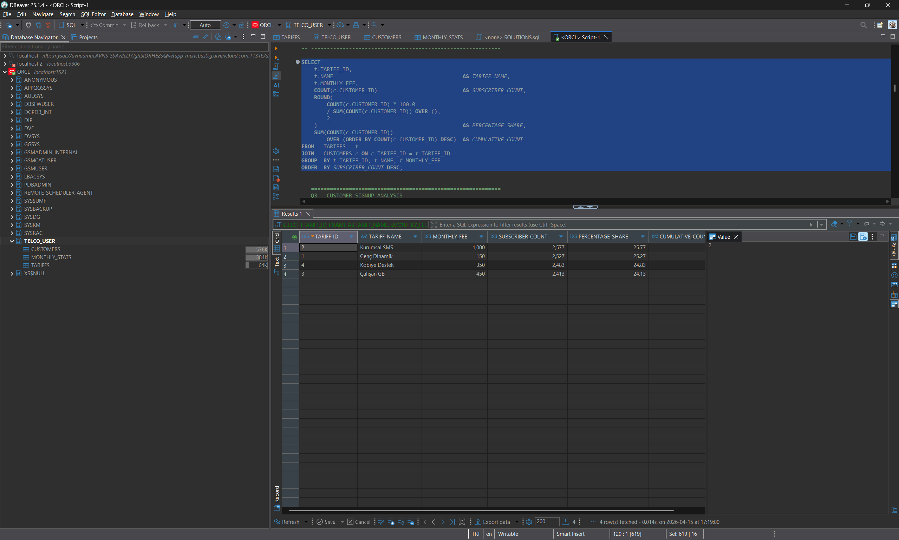

---

### Q3 – Customer Signup Analysis

#### Q3.1 – Earliest customers to sign up

**Earliest date: 07/04/2025** — 35 customers  
*(Note: earliest subscribers do NOT have the lowest IDs — SIGNUP_DATE is used, not CUSTOMER_ID)*

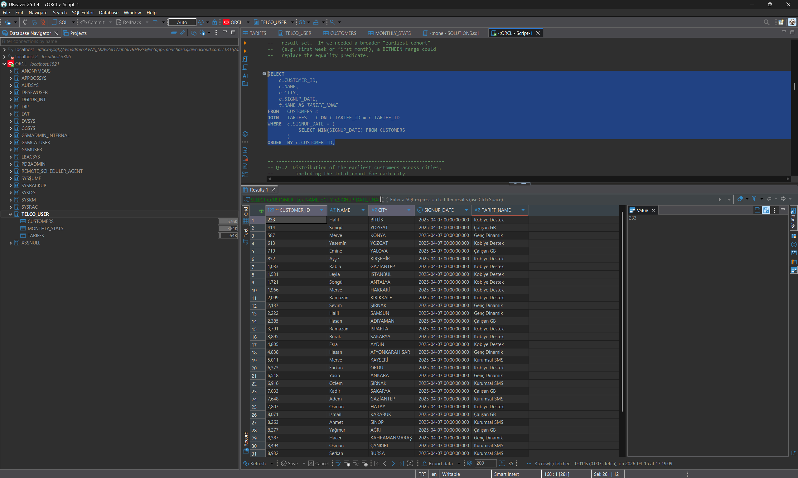

#### Q3.2 – City distribution of earliest customers

**Result:** 35 customers across 30 different cities

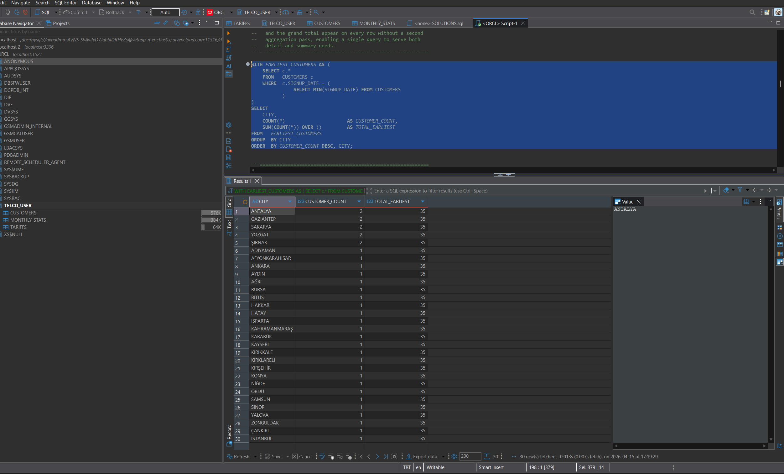

---

### Q4 – Missing Monthly Records

#### Q4.1 – Customers with missing monthly stats

**Result:** 50 customers have no MONTHLY_STATS record due to an insertion error

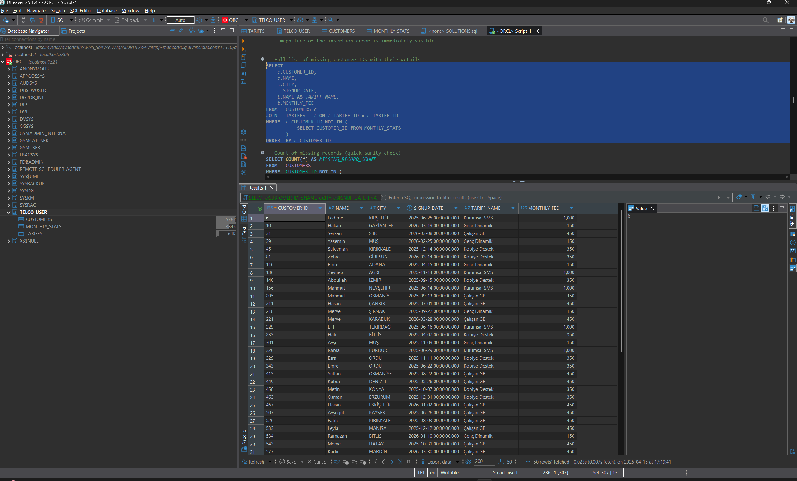

#### Q4.2 – City distribution of missing customers

**Result:** 50 customers across 39 cities — most affected: Osmaniye (3)

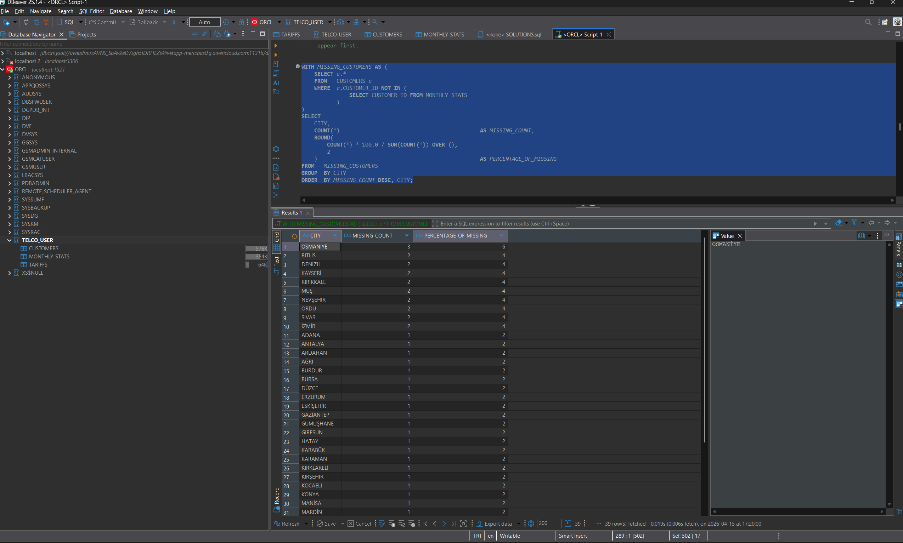

---

### Q5 – Usage Analysis

#### Q5.1 – Customers who used at least 75% of their data limit

**Result:** 1 880 customers  
*(Kurumsal SMS tariff excluded — DATA_LIMIT = 0, so division by zero would occur)*

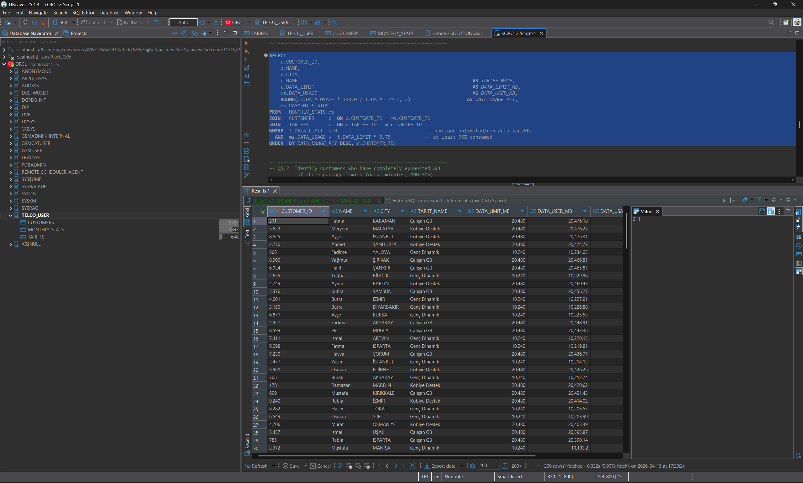

#### Q5.2 – Customers who exhausted all package limits (data + minutes + SMS)

**Result:** 0 customers — no subscriber simultaneously exhausted all three limits

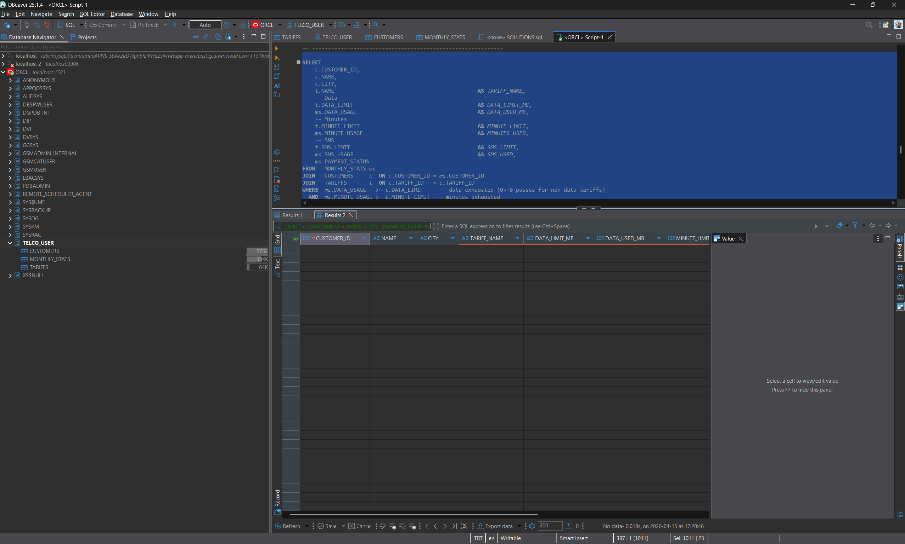

---

### Q6 – Payment Analysis

#### Q6.1 – Customers with unpaid fees

**Result:** 1 454 UNPAID records

| Status | Count | Share |
|--------|-------|-------|
| PAID | 6 999 | 70.34% |
| LATE | 1 497 | 15.04% |
| UNPAID | 1 454 | 14.61% |

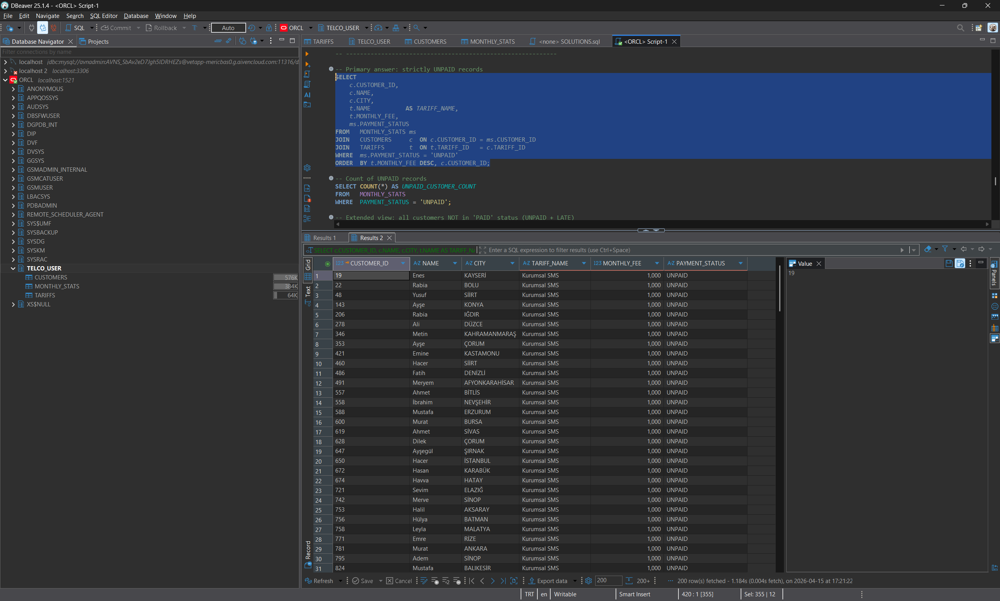

#### Q6.2 – Distribution of payment statuses across tariffs

| Tariff | PAID % | LATE % | UNPAID % |
|--------|--------|--------|---------|
| Kurumsal SMS | 69.96% | 14.34% | 15.70% |
| Kobiye Destek | 69.57% | 15.86% | 14.57% |
| Calisan GB | 70.62% | 15.23% | 14.15% |
| Genc Dinamik | 71.22% | 14.79% | 13.99% |

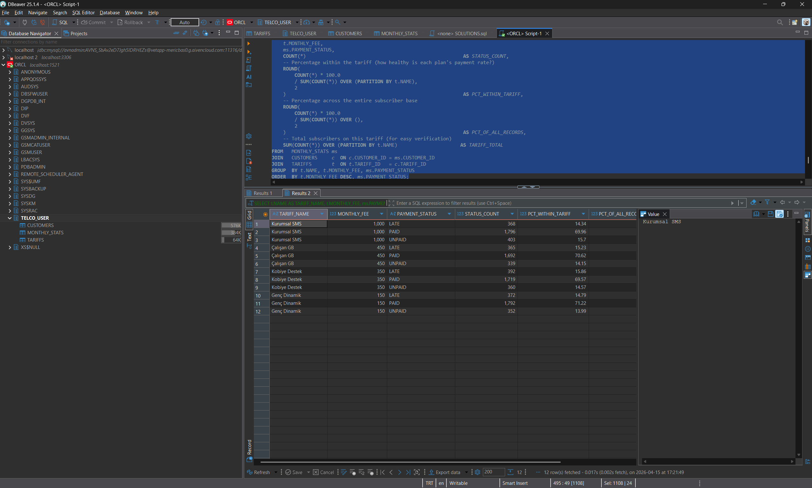

---

## Database Schema

```
TARIFFS (4 rows)
┌──────────────────────────────────────────────────┐
│ TARIFF_ID    NUMBER(2)      PK                   │
│ NAME         NVARCHAR2(50)  NOT NULL             │
│ MONTHLY_FEE  NUMBER(8,2)    NOT NULL  CHECK > 0  │
│ DATA_LIMIT   NUMBER(10)     NOT NULL  (MB)       │
│ MINUTE_LIMIT NUMBER(6)      NOT NULL             │
│ SMS_LIMIT    NUMBER(6)      NOT NULL             │
└─────────────────────┬────────────────────────────┘
                      │ 1:N
CUSTOMERS (10 000 rows)
┌──────────────────────────────────────────────────┐
│ CUSTOMER_ID  NUMBER(6)      PK                   │
│ NAME         NVARCHAR2(50)  NOT NULL             │
│ CITY         NVARCHAR2(50)  NOT NULL             │
│ SIGNUP_DATE  DATE           NOT NULL             │
│ TARIFF_ID    NUMBER(2)      FK → TARIFFS         │
└─────────────────────┬────────────────────────────┘
                      │ 1:0..1
MONTHLY_STATS (9 950 rows — 50 records missing)
┌──────────────────────────────────────────────────┐
│ STAT_ID        NUMBER(6)    PK                   │
│ CUSTOMER_ID    NUMBER(6)    FK → CUSTOMERS       │
│ DATA_USAGE     NUMBER(10,2) NOT NULL  (MB)       │
│ MINUTE_USAGE   NUMBER(6)    NOT NULL             │
│ SMS_USAGE      NUMBER(6)    NOT NULL             │
│ PAYMENT_STATUS VARCHAR2(10) CHECK IN             │
│                ('PAID','UNPAID','LATE')          │
└──────────────────────────────────────────────────┘
```

---

## Technologies

| Tool | Version | Purpose |
|------|---------|---------|
| Oracle XE | 21c | Relational database |
| Docker Desktop | 4.x+ | Container environment |
| DBeaver Community | 24.x+ | SQL client & data import |
| Python | 3.8+ | MONTHLY_STATS.csv import (`oracledb`) |

---

## Known Data Issues

| Issue | Detail | Resolution |
|-------|--------|------------|
| European decimal in DATA_USAGE | `MONTHLY_STATS.csv` uses `,` as decimal separator | Handled automatically by `telco_import.py` |
| Missing monthly records | 50 customers have no MONTHLY_STATS row | Expected — intentional insertion error in the dataset |
| Non-sequential CSV order | `CUSTOMERS.csv` is not sorted by CUSTOMER_ID | Use SIGNUP_DATE for chronological analysis (Q3) |

---

## Stop / Reset

```bash
# Stop the container (data is preserved)
docker compose down

# Full reset — deletes all data
docker compose down -v
docker compose up -d
```
